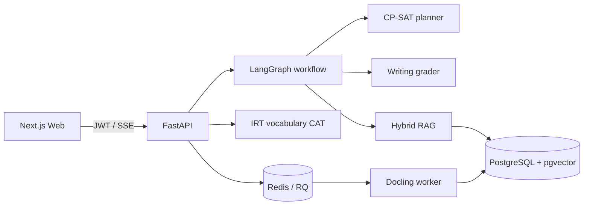

# IELTS Adaptive Coach

面向中国 IELTS Academic 考生的自适应学习规划与写作反馈系统。项目将学习目标、时间约束和练习表现转换成可审核的周计划，并使用带来源引用的 IELTS 官方评分标准生成写作反馈。

> 所有分数均为非官方 AI 估分，只用于学习反馈。本项目与 IELTS、British Council、IDP 或 Cambridge University Press 无隶属关系。

## 已实现

- 完整的邮箱注册/登录、可选持久会话、退出登录、用户中心、改密和一键演示账号；所有业务查询按用户隔离。
- LangGraph 显式规划工作流：`intake → diagnose → retrieve → plan → validate`。
- OR-Tools CP-SAT 周计划器，以及缺少 OR-Tools 时的确定性降级方案。
- 草案/批准/废弃状态，未批准计划不会替换正式日程。
- OpenAI Responses API JSON Schema 写作评估，并兼容 DeepSeek Responses API；无密钥时使用明确标记的离线规则基线。
- 四项写作标准、作文原文证据位置、官方评分标准链接和置信度。
- Vocabulary Size Test 风格的五选一词义测评、IRT/EAP 自适应选题、CEFR A1–C2 参考层级和可恢复测试会话。
- Docling 文档摄入、Redis/RQ 后台任务、上传大小和扩展名限制。
- 可编辑的考试日期、四科当前/目标分数、每日可用时间和优先科目画像。
- 周计划读取最近一次词汇测评：未测评时安排测评任务，测评后按能力值、正确率和不确定度调整词汇巩固频次。
- 分页式学习工作台、四科套题浏览、表单化私人题目录入及按需显示答案解析。
- 服务端客观题判分、最近作答统计、错题复习和答对后自动移出错题集。
- 本地多语言 FastEmbed + PostgreSQL 全文检索 + pgvector + RRF；SQLite 开发环境使用可移植混合检索。
- Next.js Dashboard、用户中心、学习偏好、能力雷达图、计划审批、任务完成和写作实验室。
- Alembic、Docker Compose、GitHub Actions 和核心算法测试。

## 架构



更完整的边界与数据流见 [docs/ARCHITECTURE.md](docs/ARCHITECTURE.md)。

## 快速开始

### Docker Compose（推荐）

1. 复制 `.env.example` 为 `.env`，至少修改 `JWT_SECRET`。
2. 可选：配置 `OPENAI_API_KEY`。留空时系统仍能运行，但写作反馈会显示为低置信度离线基线；RAG 语义检索无需 API。
3. 启动：

```bash
docker compose up --build
```

- Web：<http://localhost:3000>
- OpenAPI：<http://localhost:8000/docs>
- Health：<http://localhost:8000/api/v1/health>

### 不使用 Docker

后端支持 Python 3.11–3.14；生产 Docker 镜像固定为 Python 3.12：

```bash
cd backend
python -m venv .venv
.venv/Scripts/pip install -e ".[dev]"
.venv/Scripts/uvicorn app.main:app --reload
```

默认使用本地 SQLite。前端：

```bash
cd frontend
npm install
npm run dev
```

PDF/DOCX 解析需要额外执行 `pip install -e ".[documents]"`。TXT/Markdown 无需 Docling。

题库与检索资料采用两条不同的数据管线：PDF/DOCX/TXT/MD 在“学习资料”页面建立检索索引；可直接练习和展示的题目在“练习题库 → 录入新题”中使用普通表单逐题录入。后端仍保留 JSON/CSV 批量导入接口供管理员或开发者使用，模板位于 `frontend/public/question-bank-template.json`，单次最多导入 500 题。内置题目均为项目原创仿真练习，不包含商业题库内容。

前端按职责拆分为登录/注册、学习概览、用户中心、设置、学习档案、本周计划、词汇测评、练习题库、学习资料和写作反馈。首次访问会进入登录页，不再自动使用共享演示数据；仍可显式选择演示账号。开发环境默认通过 Next.js 的 `/api` 同源转发访问后端，避免额外配置跨端口请求；部署时可用 `NEXT_PUBLIC_API_URL` 覆盖。

### 模型供应商

OpenAI 官方 API 使用默认配置即可。OpenAI-compatible 服务还需设置 `OPENAI_BASE_URL` 和服务商提供的准确模型 ID。例如 DeepSeek：

```env
OPENAI_API_KEY=your-deepseek-key
OPENAI_BASE_URL=https://api.deepseek.com
OPENAI_MODEL=deepseek-v4-flash
OPENAI_REASONING_EFFORT=none
LLM_PROVIDER=openai_compatible
EMBEDDING_PROVIDER=fastembed
LOCAL_EMBEDDING_MODEL=sentence-transformers/paraphrase-multilingual-MiniLM-L12-v2
```

DeepSeek 的 Responses API 只承担写作评分。RAG 默认使用本地 `paraphrase-multilingual-MiniLM-L12-v2`，不需要第二个 API；首次启动会下载约 220 MB 的 ONNX 模型，之后从 `FASTEMBED_CACHE_PATH` 读取。模型输出和 pgvector 列统一为 384 维。若本地模型暂时不可用，系统会记录警告并明确标记为 `hashing-demo-fallback`，该模式只能用于功能演示，不能作为语义检索评测结果。

也可另配兼容 OpenAI Embeddings API 的服务：设置 `EMBEDDING_PROVIDER=openai`、`EMBEDDING_API_KEY`、`EMBEDDING_BASE_URL` 与 `OPENAI_EMBEDDING_MODEL`；接口必须支持请求 384 维输出。

真实模型烟雾测试只发送仓库内置的无个人信息示例作文，并且不会打印密钥：

```bash
cd backend
.venv/Scripts/python scripts/smoke_live_model.py
.venv/Scripts/python scripts/smoke_local_embedding.py
```

切换 embedding 模型或向量维度后，需重算已有知识块（向量是可再生的派生数据）：

```bash
cd backend
.venv/Scripts/python scripts/reembed_knowledge.py
```

## 关键接口

| 方法 | 路径 | 作用 |
|---|---|---|
| `POST` | `/api/v1/auth/register` | 注册并取得 JWT |
| `POST` | `/api/v1/auth/login` | 邮箱密码登录 |
| `POST` | `/api/v1/auth/demo` | 创建/进入演示空间 |
| `GET/PATCH` | `/api/v1/auth/me` | 查看或修改当前账号资料 |
| `POST` | `/api/v1/auth/change-password` | 校验当前密码后修改密码 |
| `GET/PUT` | `/api/v1/settings` | 读取或保存学习偏好 |
| `POST` | `/api/v1/diagnostics` | 保存四科能力画像与时间约束 |
| `POST` | `/api/v1/plans/generate` | 运行 Agent，生成未批准草案 |
| `POST` | `/api/v1/plans/{id}/approve` | 人工确认并替换旧计划 |
| `GET` | `/api/v1/plans/today` | 获取今日正式任务 |
| `POST` | `/api/v1/tasks/{id}/complete` | 标记正式计划任务完成 |
| `POST` | `/api/v1/tasks/{id}/restore` | 将误标完成的任务恢复为待完成 |
| `POST` | `/api/v1/writing/assessments` | 返回结构化写作估分、证据和引用 |
| `POST` | `/api/v1/vocabulary/tests` | 开始 15–20 题自适应词义选择测试 |
| `POST` | `/api/v1/vocabulary/tests/{id}/responses` | 作答并取得下一道最大信息量题目 |
| `POST` | `/api/v1/knowledge/documents` | 上传用户私有资料并排队解析 |
| `GET` | `/api/v1/knowledge/documents` | 查看公共及当前用户的私人资料状态 |
| `POST` | `/api/v1/question-bank/import` | 导入 JSON/CSV 私人结构化题库 |
| `POST` | `/api/v1/question-bank/questions` | 通过普通表单新增一题到私人题库 |
| `POST` | `/api/v1/question-bank/questions/{id}/attempts` | 提交答案并返回判分与解析 |
| `GET` | `/api/v1/question-bank/progress` | 查询题库练习正确率和四科进度 |
| `GET` | `/api/v1/question-bank/questions` | 按科目和题干搜索可访问题目 |
| `POST` | `/api/v1/rag/query` | 执行用户隔离的混合检索 |
| `POST` | `/api/v1/agent/runs/stream` | 查看工作流 SSE 进度事件 |

生成计划支持 `Idempotency-Key`，重复请求会返回同一份计划。

## 验证

```bash
cd backend
ruff check app tests
pytest

cd ../frontend
npm run typecheck
npm run build
```

检索评测采用 `evals/retrieval_gold.jsonl`。当前文件是可执行的小型 smoke 集，不冒充计划中的 100 条人工金标准；扩充方法、验收阈值和结果填写规则见 [docs/EVALUATION.md](docs/EVALUATION.md)。

## 安全与数据边界

- API 从 JWT `sub` 获取用户身份，不接受请求体传入的 `user_id`。
- 私有知识块检索始终添加 `owner_id IS NULL OR owner_id = current_user` 条件。
- 上传文件不会作为系统指令；生成提示词将知识块视为不可信证据。
- 模型调用设置 `store=false`，密钥只存在后端环境变量。
- 内置内容是对官方公开评分维度的短篇释义与原始链接，不复制商业题库。
- 词汇题目、中文释义和干扰项均由项目自行编写，没有复制商业或论文附属题库；目前 IRT 参数是工程先验而非真实样本标定值。

详细政策见 [docs/DATA_POLICY.md](docs/DATA_POLICY.md)。

## 仍需完成的作品集里程碑

- 将 retrieval gold set 扩展到至少 100 条双人复核问题。
- 用公开或明确授权、带人评标签的作文校准模型，报告 MAE 和 ±0.5 band 一致率。
- 收集经同意的匿名词汇测试作答，进行题目拟合、DIF 公平性分析和外部效度验证；标定前词汇量范围始终显示为实验结果。
- 增加 Playwright 端到端测试、速率限制和托管 Auth/JWKS 验证。
- 真实部署后补充截图、2–3 分钟演示视频、延迟/成本指标和公网地址。

在这些指标实际测量前，README 和简历中不得填写虚构数据。

## 词汇测试方法说明

测评界面参考 [Nation 与 Beglar 的 Vocabulary Size Test](https://openaccess.wgtn.ac.nz/articles/journal_contribution/A_vocabulary_size_test/12552197) 的词义选择思路，
每题提供四个中文释义和“以上都不是”；自适应部分采用 IRT/CAT。当前实现使用五选一猜测参数 `c=0.2`、标准正态先验下的
EAP 能力估计，以及 Fisher information 最大化选题。达到 15 题且标准误不高于 0.45 时提前停止，
否则最多 20 题。词族范围只是待校准映射；完成真实样本标定前，不能把它宣传为标准化测量。

结果采用 CEFR A1、A2、B1、B2、C1、C2 六级作为易读的参考标签。CEFR 官方提供的是语言运用能力描述，不规定各等级对应的固定词汇数量；本项目显示的词族区间是待标定的工程估计，不能作为 CEFR 或 IELTS 官方换算。[Council of Europe CEFR descriptors](https://www.coe.int/en/web/common-european-framework-reference-languages/cefr-descriptors)、[English Vocabulary Profile](https://englishprofile.org/)
