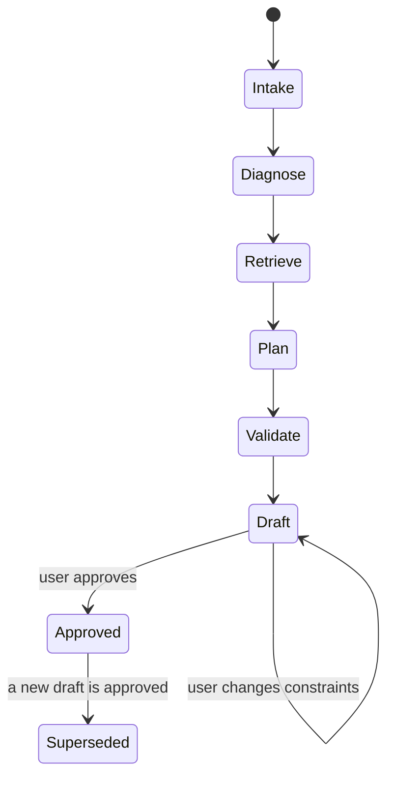
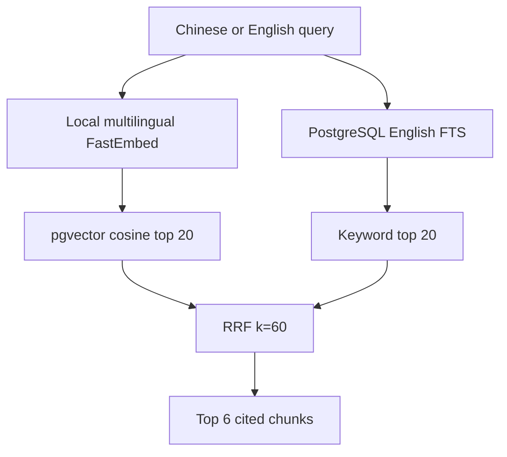
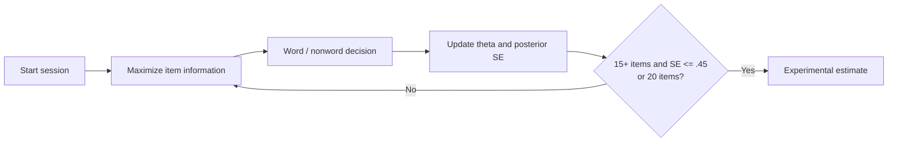

# Architecture decision record

## Context and boundaries

The MVP optimizes for an interviewable AI/backend system rather than a full IELTS question bank. Writing and adaptive planning are deep paths; Listening, Reading and Speaking are represented in the learner model and schedule only.

The vocabulary diagnostic is a separate measurement path. It does not convert an uncalibrated vocabulary result directly into an IELTS band, because that relationship has not yet been established with validation data.

The system treats three data classes differently:

1. Public knowledge: short paraphrases and links to official IELTS resources.
2. Private knowledge: documents uploaded by one authenticated user.
3. Commercial materials: never bundled, scraped or redistributed.

## Planning workflow

The language model may explain priorities and select task templates, but it does not own calendar invariants. CP-SAT owns daily capacity, required weekly sessions and high-load limits. `validate_plan` is run after every solver result, including the deterministic fallback.

The database transition from `draft` to `approved` is the human-in-the-loop boundary. It is intentionally outside the model turn: approval can be audited, retried with an idempotency key, and cannot be fabricated by generated text.

## Retrieval flow

PostgreSQL is the production source of truth. The default `paraphrase-multilingual-MiniLM-L12-v2` model produces 384-dimensional vectors locally, without an embedding API. `embedding_vector vector(384)` powers HNSW retrieval and the generated `search_tsv` column powers keyword retrieval. A JSON copy of embeddings supports SQLite smoke tests and migration/debugging. A model change requires re-embedding existing chunks; the migration deliberately treats vectors as reproducible derived data.

Metadata fields are designed for `module`, `task_type`, `criterion`, `band`, `license`, document version, page and owner. Tenant filtering is applied before ranking, never after it.

## Writing assessment

The model adapter receives the essay, prompt and retrieved rubric summaries, then returns `WritingAssessment` through JSON Schema. Validation enforces:

- exactly four distinct IELTS writing criteria;
- half-band values in `[0, 9]`;
- overall score equals the rounded criterion mean;
- every criterion contains an exact essay span and at least one citation;
- a visible unofficial-score disclaimer.

No API key invokes `DeterministicWritingGrader`. Its low confidence and model name make it impossible for the UI to silently present heuristic output as a model or examiner result.

For OpenAI-compatible providers, Pydantic schemas are normalized to a portable strict subset. Model output is never trusted for deterministic facts: the API recalculates the overall band from criterion bands, resolves evidence offsets against the submitted essay, and replaces generated citation payloads with retrieved source records. Provider timeout, retry count, reasoning effort and output-token limits are configuration values.

## Adaptive vocabulary diagnostic

The item response curve uses a fixed lower asymptote of `0.5` for a binary decision and item-specific difficulty/discrimination priors. Ability is updated by expected a posteriori estimation on `[-4, 4]` with a standard normal prior. A session-specific content schedule keeps roughly one third nonwords, while item selection maximizes Fisher information within the scheduled class.

The checked-in bank is project-authored. Its item parameters and word-family mapping are prototypes, not psychometrically calibrated measurements. Production validation requires a larger bank, real response data, item-fit checks, reliability, differential item functioning analysis and comparison with an external validated measure.

## Reliability and security

- Plan generation persists a trace and accepts an idempotency key.
- Document work is queued in RQ; an in-process background fallback keeps local demos usable.
- JWT identity is resolved to a database user before any business query.
- Passwords use salted `scrypt`; production deployments should prefer managed Auth with asymmetric JWKS.
- Unexpected ingestion failures are persisted as a status rather than losing the job silently.
